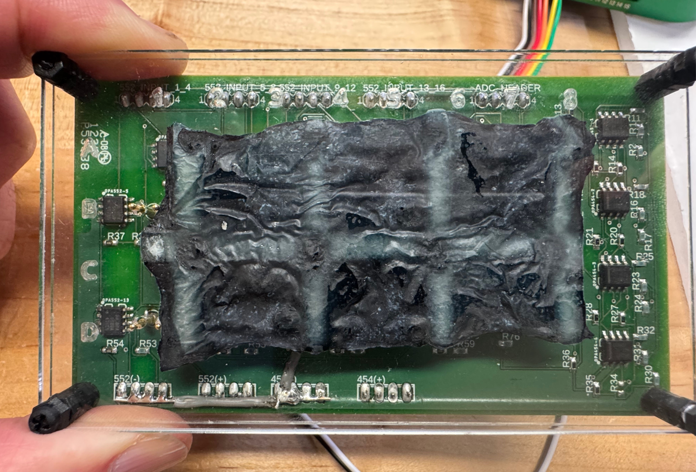

# Neuromorphic Mycelium Chip

We introduce a neuromorphic computing substrate based on PEDOT:PSS-infused mycelium, a biofabricated, morphologically tunable material that can be engineered into electrically active components including resistors, capacitors, and diode-like elements. Leveraging the principles of physical reservoir computing, we demonstrate that mycelium networks grown under controlled environmental conditions can transform time-varying inputs into nonlinear, high-dimensional state trajectories, enabling machine learning tasks such as NARMA-10 sequence prediction.

*For detailed experimental methods and results, see the primary research paper: `telhan_morph_tuned_mycelium_chip_Aug4.pdf`* 

## Overview



This project implements neuromorphic computing systems using mycelium networks as biological substrates for:
- **NARMA-10 Reservoir Computing**: Time-series prediction using mycelium as a reservoir
- **Temporal Memory Analysis**: Characterization of mycelium's memory capabilities

## 🔬 Research Contributions

### Neuromorphic Computing with Mycelium
- First demonstration of mycelium-based reservoir computing
- Temporal memory characterization in mycelium networks
- Hardware-software integration with Digilent devices

### Key Achievements
- **NARMA-10 Benchmark**: Successfully trained mycelium networks for time-series prediction
- **Memory Analysis**: Quantified temporal memory effects in mycelium
- **Hardware Integration**: Real-time voltage control and measurement

## 📁 Repository Structure

```
NeuromorphicMyceliumChip/
├── src/                          # Core implementation
│   ├── mycelium_narma10.py      # NARMA-10 reservoir computing
│   ├── mycelium_memory_test.py  # Memory analysis tools
│   └── cleanup_devices.py       # Device management utilities
├── data/                         # Sample data files
│   ├── sample_narma_results.csv # NARMA-10 experimental results
│   ├── narma10_results_*.csv    # Multiple NARMA-10 test runs
│   ├── memory_test_step_response_test_*.csv # Step response data
│   ├── memory_test_random_input_*.csv # Random input memory data
│   └── memory_test_sine_wave_test_*.csv # Sine wave memory data
├── docs/                         # Documentation
├── tests/                        # Test files
├── examples/                     # Usage examples
├── requirements.txt              # Python dependencies
├── run_predictor.sh             # Environment setup script
└── telhan_morph_tuned_mycelium_chip_Aug4.pdf  # Primary research paper
```

## 🚀 Quick Start

### Prerequisites
- Python 3.12+
- Digilent WaveForms framework
- Digilent Analog Discovery 2 (AD2) or similar devices

### Installation

1. **Clone the repository**
```bash
git clone https://github.com/yourusername/NeuromorphicMyceliumChip.git
cd NeuromorphicMyceliumChip
```

2. **Install dependencies**
```bash
pip install -r requirements.txt
```

3. **Setup Digilent environment**
```bash
# Install Digilent WaveForms from https://digilent.com/reference/software/waveforms/
# Connect your Digilent devices
chmod +x run_predictor.sh
```

### Running Experiments

#### NARMA-10 Reservoir Computing
```bash
./run_predictor.sh src/mycelium_narma10.py
```


#### Memory Analysis
```bash
./run_predictor.sh src/mycelium_memory_test.py
```

## 🔧 Hardware Requirements

### Digilent Devices
- **Device 1**: Analog Discovery 2 (AD2) for voltage control and measurement
- **Device 2**: Analog Discovery 3 for additional voltage control
- **Connection**: USB connection to both devices
- **Channels**: 16 independent input channels operating in parallel

### Mycelium Setup
- **Substrate**: Mycelium network on appropriate growth medium
- **Electrodes**: Conductive electrodes for voltage application and measurement
- **Environment**: Controlled humidity and temperature conditions
- **Carrier Board**: Analog interface with 4x gain amplification (0-5V to 16-18V)
- **Reservoirs**: 3 reservoirs (locations A1, A4, A6) across 3 chips

## 📊 Results

### Available Experimental Data
The repository includes comprehensive experimental data from our neuromorphic mycelium computing experiments:

**NARMA-10 Data:**
- `narma10_results_*.csv`: Multiple test runs with input, state, target, and prediction columns
- Contains 200+ samples per experiment with Ridge and Random Forest predictions

**Memory Characterization Data:**
- `memory_test_step_response_test_*.csv`: Step input response data (time, input, state)
- `memory_test_random_input_*.csv`: Random pulse input memory data
- `memory_test_sine_wave_test_*.csv`: Sine wave input temporal dynamics

**Data Format:**
- All CSV files include timestamps, input signals, and mycelium state responses
- NARMA-10 files include both true targets and model predictions
- Memory test files contain time-series data for temporal analysis

### NARMA-10 Performance
- **Training Samples**: 500 and 1,000 samples per model
- **Test Performance**: Multiple independent test experiments
- **Model Optimization**: Multiple iterations with parameter tuning
- **Results**: 
  - **Ridge Regression**: RMSE 0.102-0.106 (NRMSE 1.01-1.07)
  - **Random Forest**: Training RMSE 0.096, Test RMSE 0.197
- **Method**: Ridge regression with normalization and Random Forest with nonlinear feature transformations
- **Features**: Reservoir state, squared state, and trigonometric expansions (sin(state×3), cos(state×2))
- **Hardware**: 3 reservoirs (locations A1, A4, A6) across 1 chip
- **Note**: First demonstration of temporal computing in biodegradable, agriculturally scalable substrate


### Memory Characterization
- **Temporal Memory**: R² improvement of 0.026-0.034 with historical inputs
- **Response Dynamics**: Step response, autocorrelation, and cross-correlation analysis
- **State Prediction**: Predictive modeling with input history
- **Settling Time**: 0.1-1s
- **Input Types**: Step signals, random pulses, and sine waves
- **Hardware**: 3 reservoirs tested across multiple input patterns

#### Detailed Memory Results
**Step Input**: 
- Autocorrelation: 0.85 (lag=6s), Cross-correlation: 1.0 (lag=0s)
- R²: 0.74 (no improvement with history)
- Settling time: 0.6s

**Random Input (1.1-3.49V)**:
- Autocorrelation: 0.20 (lag=0.3s), Cross-correlation: 1.0 (lag=0s)
- R² improvement: 0.577 → 0.611 (+0.034)

**Sine Wave Input (1.2-3.5V)**:
- Autocorrelation: 0.497 (lag=1s), Cross-correlation: 0.689 (lag=1s)
- R² improvement: 0.4745 → 0.5005 (+0.026)

## 🛠️ Technical Details

### Software Architecture
- **GUI Framework**: PyQt6 for user interfaces
- **Machine Learning**: scikit-learn for classification and regression
- **Data Analysis**: pandas, numpy, matplotlib for analysis
- **Hardware Interface**: ctypes for Digilent device communication

### Key Algorithms
- **Reservoir Computing**: Mycelium as nonlinear dynamical system
- **Ridge Regression**: For NARMA-10 prediction
- **t-SNE Visualization**: High-dimensional state analysis

## 📈 Experimental Protocol

### NARMA-10 Training
1. Generate 1,000 NARMA-10 training samples
2. Apply voltage signals (0-5V range) to 3 reservoirs (A1, A4, A6)
3. Record mycelium state responses from summed output channels
4. Create feature representations (raw state, squared state, trigonometric expansions)
5. Train Ridge regression and Random Forest models
6. Evaluate prediction performance across multiple experiments


### Memory Analysis
1. Apply three input types: step signals, random pulses, sine waves
2. Measure autocorrelation and cross-correlation metrics
3. Analyze temporal dynamics across three reservoirs
4. Quantify settling time and memory retention
5. Evaluate R² improvement with historical inputs

## 🔬 Research Significance

This project demonstrates that mycelium networks can serve as effective substrates for neuromorphic computing, providing:
- **Reservoir Computing**: PEDOT:PSS-based nonlinear dynamics
- **Temporal Memory**: Inherent memory capabilities
- **Scalability**: Network growth and adaptation
- **Sustainability**: Biodegradable computing substrates

## 📚 References

### Primary Research Paper
- **Telhan, O. et al.** (2025). Morphologically Tuned Mycelium Chip for Neuromorphic Computing. *Available in this repository as* `telhan_morph_tuned_mycelium_chip_Aug4.pdf`

### Background Literature
- Reservoir Computing principles
- NARMA-10 benchmark task
- Mycelium network properties
- Neuromorphic computing architectures

## 🤝 Contributing

This is a research project. For questions or collaboration, please contact the research team.

## 📄 License

This project is licensed under the MIT License - see the LICENSE file for details.

## 🙏 Acknowledgments

- DARPA for research funding

---

**Note**: This project requires specialized hardware (Digilent devices) and biological materials (mycelium chips). Full replication requires access to these resources. 